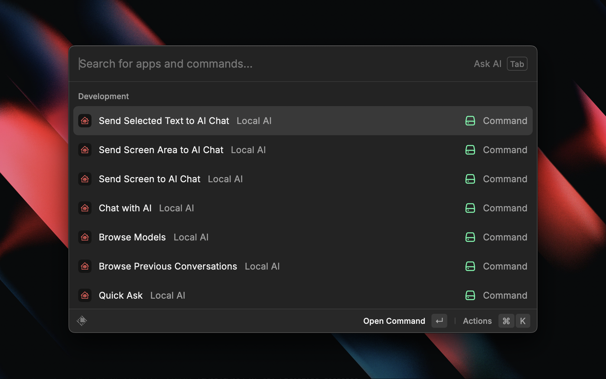
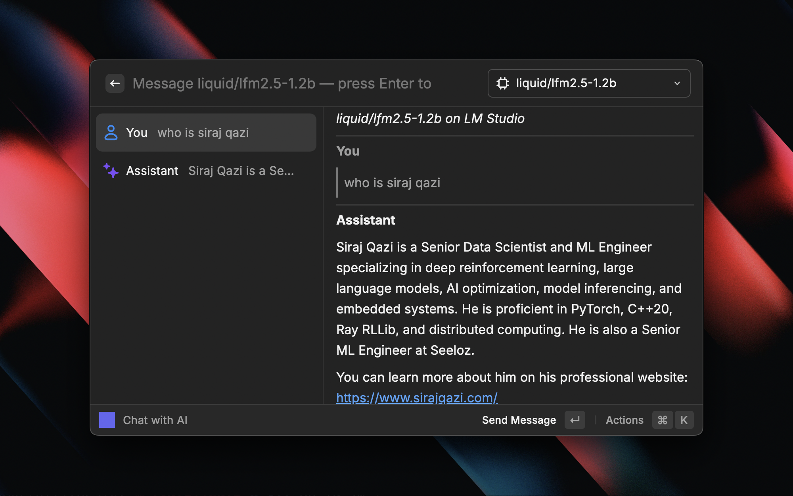
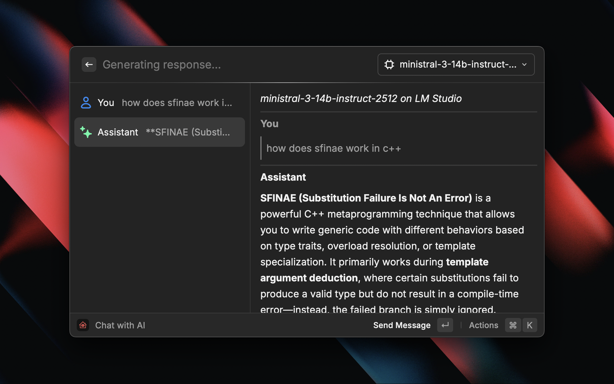
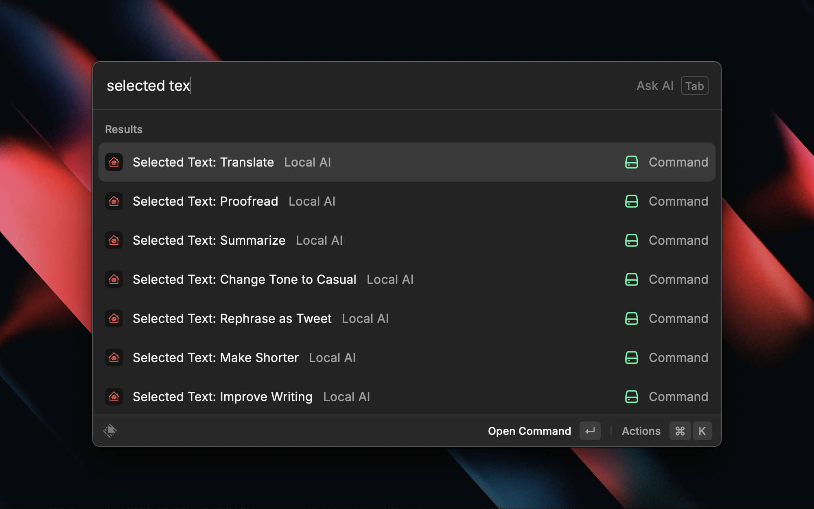
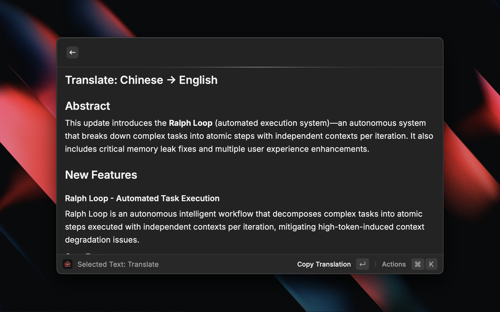
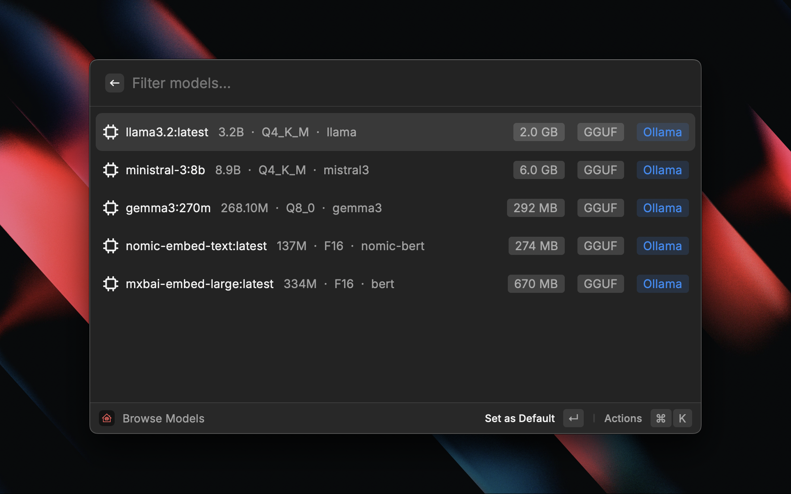
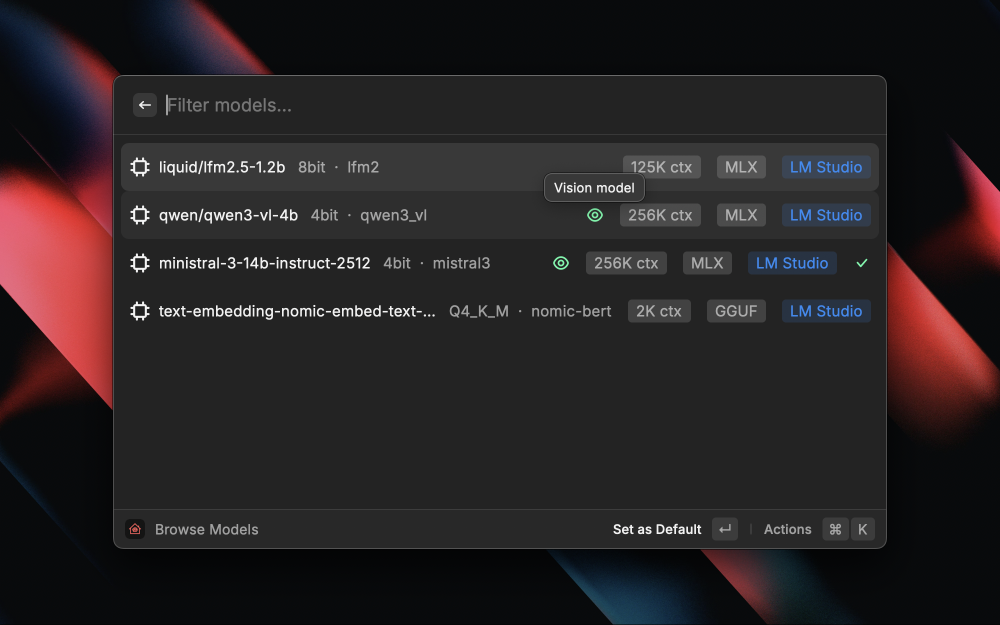

# Local AI

Chat with local LLMs (LM Studio/Ollama/llama.cpp/other) from Raycast - no cloud, no API keys, no subscriptions.

<p align="center">
  
</p>

Local AI connects to your locally-running LLM server and provides a native Raycast experience with streaming chat, 14 text transform commands, vision/screenshot analysis, web search, and more. Everything runs on your machine.

## Supported Providers

| Provider | Default Port | Install | Start Server |
|----------|:---:|---------|-------------|
| [Ollama](https://ollama.com) | 11434 | [ollama.com](https://ollama.com) | `ollama serve` |
| [LM Studio](https://lmstudio.ai) | 1234 | [lmstudio.ai](https://lmstudio.ai) | Start server in app |
| [llama.cpp](https://github.com/ggml-org/llama.cpp) | 8080 | [github](https://github.com/ggml-org/llama.cpp) | `llama-server -m model.gguf` |
| Custom | - | - | Any OpenAI-compatible endpoint |

## Features

### Chat with AI

Full-featured chat with streaming responses, conversation history, model switching, and markdown rendering.

<p align="center">
  
</p>

- Real-time streaming with live markdown rendering
- Switch models mid-conversation via the dropdown selector
- Per-session temperature, max tokens, and system prompt overrides
- 8 built-in system prompt presets (Technical, Creative, Tutor, Code Review, etc.)
- Auto-saves conversations with full history
- Export conversations as Markdown to Desktop (Cmd+E)
- Copy individual responses or entire conversations

<p align="center">
  
</p>

### Quick Ask

One-off questions without starting a full chat. Type your question directly in the Raycast argument field for instant answers.

### 14 Text Transform Commands

Select text in any app (or copy to clipboard), trigger a command, and get AI-transformed results instantly.

<p align="center">
  
</p>

| Command | Description |
|---------|-------------|
| Fix Spelling & Grammar | Correct errors in selected text |
| Improve Writing | Enhance clarity and style |
| Make Shorter | Condense while preserving meaning |
| Make Longer | Expand with more detail |
| Change Tone to Professional | Rewrite in a professional tone |
| Change Tone to Casual | Rewrite in a casual tone |
| Change Tone to Friendly | Rewrite in a warm, friendly tone |
| Change Tone to Confident | Rewrite in a confident, assertive tone |
| Explain Code | Step-by-step code explanation |
| Explain Simply | Plain-language explanation |
| Translate | Translate between 20 languages with source/target picker |
| Summarize | Extract key points |
| Proofread | List errors with suggested corrections |
| Rephrase as Tweet | Rewrite under 280 characters |

<p align="center">
  
</p>

### Browse Models

View all models on your server with rich metadata. Ollama and LM Studio display parameter size, quantization level, model family, disk size, context window, format, and vision capability.

<p align="center">
  
</p>

<p align="center">
  
</p>

- Set any model as the default
- Start a chat directly from the model list
- Vision-capable models are marked with an eye icon

### Screenshot & Vision

Send screenshots or clipboard images to vision-capable models for analysis.

| Command | Description |
|---------|-------------|
| Send Screen to AI Chat | Captures your full screen and sends it to chat |
| Send Screen Area to AI Chat | Opens macOS crosshair selector for region capture |
| Send Clipboard Image (Cmd+Shift+V) | Sends a copied image directly in chat |

> **Note:** Requires a vision model. Recommended: `ollama pull qwen3-vl:4b`

### Send Selected Text to Chat

Grab selected text from any app and send it directly to AI Chat with the text pre-filled in the input.

### Web Search

Give your AI access to up-to-date web information.

- **Tier 1 - Prompt-based** (any model): A heuristic detects when your query needs web results, fetches them via Brave Search API, and injects them as context before the LLM call.
- **Tier 2 - Tool calling** (capable models): The model decides when to search using OpenAI-compatible tool calling. Requires Llama 3.1+, Qwen 2.5+, or Mistral v0.3+.

> Requires a free Brave Search API key (2,000 queries/month). Get one at [brave.com/search/api](https://brave.com/search/api).

### Browse Previous Conversations

Search and resume any saved chat conversation, grouped by time period.

## Setup

### 1. Install a provider and download a model

```bash
# Install Ollama (macOS)
brew install ollama

# Pull a model
ollama pull llama3.2

# For vision/screenshot features
ollama pull qwen3-vl:4b
```

Or download [LM Studio](https://lmstudio.ai) and use its built-in model browser.

### 2. Start the server

```bash
# Ollama (may already be running as a service)
ollama serve

# Or for LM Studio: start the local server from within the app
# Or for llama.cpp: llama-server -m model.gguf
```

### 3. Install the extension

```bash
git clone <repo-url>
cd local-ai
npm install
npm run dev
```

### 4. First launch

On first launch, a setup form will appear where you can:

1. Select your primary provider
2. Configure server URLs (defaults are pre-filled)
3. Test the connection (Cmd+T)

## Configuration

Open extension preferences with Cmd+, in any Local AI command.

| Preference | Description | Default |
|-----------|-------------|---------|
| Provider | Which AI server to use | Ollama |
| Server URL | Custom base URL (leave empty for provider default) | - |
| Default Model | Preferred model (auto-detected if empty) | - |
| Temperature | Response creativity (0.0–2.0) | 0.7 |
| Max Tokens | Maximum response length | 2048 |
| System Prompt | Default prompt for all chats | - |
| Stream Responses | Real-time token streaming | On |
| Auto-Paste Results | Auto-paste text transform results back | Off |
| Web Search | Enable web search | Off |
| Brave Search API Key | API key for web search | - |
| Tool Calling Mode | Use native tool calling (requires capable model) | Off |

## Keyboard Shortcuts

### Chat

| Shortcut | Action |
|----------|--------|
| Enter | Send message |
| Cmd+Shift+V | Send clipboard image |
| Cmd+C | Copy last response |
| Cmd+Shift+C | Copy full conversation |
| Cmd+E | Export as Markdown |
| Cmd+S | Save conversation |
| Cmd+Shift+N | New conversation |
| Cmd+M | Change model |
| Cmd+Shift+P | Chat settings |

### Text Transform / Translate

| Shortcut | Action |
|----------|--------|
| Cmd+C | Copy result |
| Cmd+V | Paste result |
| Cmd+Shift+C | Open in Chat |
| Cmd+Shift+O | Copy original text |

### Browse Models

| Shortcut | Action |
|----------|--------|
| Enter | Set as default |
| Cmd+Enter | Start chat with model |
| Cmd+C | Copy model name |
| Cmd+R | Refresh model list |

## All Commands (21)

| Command | Type | Description |
|---------|------|-------------|
| Chat with AI | View | Full chat with streaming, history, model switching |
| Quick Ask | View | One-off question with instant answer |
| Browse Models | View | List models with metadata, set default |
| Browse Previous Conversations | View | Resume saved conversations |
| Selected Text: Fix Spelling & Grammar | View | Fix errors in selected text |
| Selected Text: Improve Writing | View | Enhance clarity and style |
| Selected Text: Make Shorter | View | Condense text |
| Selected Text: Make Longer | View | Expand text |
| Selected Text: Change Tone to Professional | View | Professional rewrite |
| Selected Text: Change Tone to Casual | View | Casual rewrite |
| Selected Text: Change Tone to Friendly | View | Friendly rewrite |
| Selected Text: Change Tone to Confident | View | Confident rewrite |
| Selected Text: Explain Code | View | Step-by-step code explanation |
| Selected Text: Explain Simply | View | Plain-language explanation |
| Selected Text: Translate | View | Translate between 20 languages |
| Selected Text: Summarize | View | Key points summary |
| Selected Text: Rephrase as Tweet | View | Under 280 characters |
| Selected Text: Proofread | View | List errors with corrections |
| Send Screen to AI Chat | No-view | Full screenshot to chat |
| Send Screen Area to AI Chat | No-view | Region screenshot to chat |
| Send Selected Text to AI Chat | No-view | Selected text to chat |

## Troubleshooting

### "Can't connect to server"

- Make sure your server is running:
  - **Ollama**: `ollama serve` or check the Ollama app is open
  - **LM Studio**: Open the app and start the local server
  - **llama.cpp**: `llama-server -m your-model.gguf`
- Verify the URL in extension preferences (default ports: Ollama 11434, LM Studio 1234, llama.cpp 8080)

### "No models found"

- Download a model first:
  - **Ollama**: `ollama pull llama3.2`
  - **LM Studio**: Download from the Discover tab
  - **llama.cpp**: Provide a GGUF file with `-m`

### "No response" when sending images

- Your model likely doesn't support vision input
- Install a vision model: `ollama pull qwen3-vl:4b`
- Vision models are marked with an eye icon in Browse Models

### Slow or laggy responses

- Local AI speed depends on your hardware - smaller models run faster
- Try quantized models (e.g., Q4_K_M variants)
- Ensure no other heavy processes are competing for GPU/CPU

## Tech Stack

- [Raycast Extension API](https://developers.raycast.com) (React + TypeScript)
- OpenAI-compatible `/v1/chat/completions` API
- SSE streaming with throttled rendering
- Ollama native `/api/tags` and LM Studio native `/api/v0/models` for rich metadata
- [Brave Search API](https://brave.com/search/api/) for web search

## License

MIT
